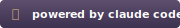

# Powered by Claude Code Badges

Custom badges for projects that run via Claude Code as the runtime.

> **Note:** These are community-created badges, not official Anthropic assets. "Claude" and "Claude Code" are trademarks of Anthropic, PBC. This project is not affiliated with or endorsed by Anthropic.

---

## Custom SVG Badges (Recommended)

These badges match the style of the awesome.re badges.

### Dark Style (Best for Light Backgrounds)


```markdown
[](https://github.com/dontoisme/awesome-powered-by-claude-code)
```

### Purple Gradient Style


```markdown
[](https://github.com/dontoisme/awesome-powered-by-claude-code)
```

### Emoji Style


```markdown
[](https://github.com/dontoisme/awesome-powered-by-claude-code)
```

---

## Shields.io Badges (Alternative)

These update dynamically but have less custom styling.

### Orange (Default)
[](https://github.com/dontoisme/awesome-powered-by-claude-code)

```markdown
[](https://github.com/dontoisme/awesome-powered-by-claude-code)
```

### For the Badge Style
[](https://github.com/dontoisme/awesome-powered-by-claude-code)

```markdown
[](https://github.com/dontoisme/awesome-powered-by-claude-code)
```

### Dark Theme
[](https://github.com/dontoisme/awesome-powered-by-claude-code)

```markdown
[](https://github.com/dontoisme/awesome-powered-by-claude-code)
```

---

## HTML Version

For websites or non-markdown contexts:

```html
<a href="https://github.com/dontoisme/awesome-powered-by-claude-code">
  
</a>
```

---

## Other AI Runtimes

For apps that support multiple AI runtimes, here are matching badge styles:

### Cursor
```markdown
[](https://github.com/YOUR_USERNAME/awesome-powered-by-cursor)
```

### GitHub Copilot
```markdown
[](https://github.com/YOUR_USERNAME/awesome-powered-by-copilot)
```

---

## Customization

Want to modify the badges? The SVG source files are in this directory. Key colors:

| Element | Color | Hex |
|---------|-------|-----|
| Anthropic Orange | Terracotta | `#D4956A` |
| Dark Background | Deep Purple | `#1A1525` |
| Gradient Start | Muted Purple | `#2D2640` |
| Text | White | `#FFFFFF` |
